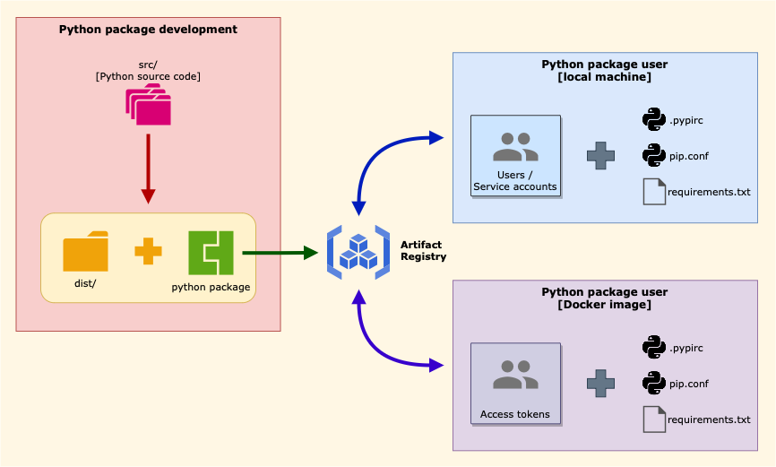

# google-artifact-registry-custom-module

## about

- This repo is for documenting how to utilize [Google Artifact Registry](https://cloud.google.com/artifact-registry) to store & access packages written in Python.
- Also document docker image integration
- It is written aside blogs described below.

## blog related

- [EN] [A private repo for our own Python packages](https://www.bluebirz.net/en/a-private-repo-for-our-own-python/)
- [TH] [Python package ของเราก็เก็บไว้ที่ repo ของเราเอง](https://www.bluebirz.net/th/a-private-repo-for-our-own-python-th/)
- [Medium] [A private repo for our own Python packages](https://medium.com/@bluebirz/a-private-repo-for-our-own-python-packages-83fbf3c308f9)

## Concept diagram



## Files structure

### compact version

```md
.
├── src-module-artifact
│   ├── entry-point-image
│   ├── entry_points
│   └── my_modules
└── src-module-local
```

### full version

<details>
<summary>click to expand</summary>

```md
google-artifact-registry-custom-module
├── .gitattributes
├── .gitignore
├── README.md
├── src-module-artifact
│   ├── entry-point
│   │   ├── .pypirc
│   │   ├── __init__.py
│   │   ├── main.py
│   │   ├── pip.conf
│   │   └── requirements.txt
│   ├── entry-point-image
│   │   ├── Dockerfile
│   │   └── src
│   │       ├── .pypirc
│   │       ├── __init__.py
│   │       ├── main.py
│   │       ├── pip.conf
│   │       └── requirements.txt
│   └── my_modules
│       ├── LICENSE
│       ├── README.md
│       ├── dist
│       │   ├── my_adder-0.1.0-py3-none-any.whl
│       │   └── my_adder-0.1.0.tar.gz
│       ├── pyproject.toml
│       ├── requirements.txt
│       ├── src
│       │   ├── my_adder
│       │   │   ├── __init__.py
│       │   │   └── adder.py
│       │   └── my_adder.egg-info
│       │       ├── PKG-INFO
│       │       ├── SOURCES.txt
│       │       ├── dependency_links.txt
│       │       └── top_level.txt
│       └── test
└── src-module-local
    ├── __init__.py
    ├── main.py
    └── my_modules
        ├── __init__.py
        └── adder.py

12 directories, 30 files
```

</details>

### brief explanation

- `/src-module-local`: import other classes & functions inside local directories
- `/src-module-artifact`: use Google Artifact Registry to store classes & functions
  - `/my_modules`: a custom package to store in Google Artifact Registry
  - `/entry-point`: a local program to call the packages installed from Google Artifact Registry
  - `/entry-point-image`: a local program to call the packages installed from Google Artifact Registry and packed in a Docker image

## How to run

### Prerequisites

1. Google Cloud SDK for upload/install packages in Google Cloud Artifact Registry
1. Python 3.7 or above
1. Created a repo in Google Artifact Registry beforehand.
1. Installed Docker

### Test run local-import

1. go into directory

    ```bash
    cd src-module-local/
    ```

1. run python script via

    ```bash
    python3 main.py
    ```

### Test run remote-import from Google Artifact Registry

1. Build and upload a package to Google Artifact Registry

    ```bash
    cd src-module-artifact/my_modules/
    pip install -r requirements.txt
    python3 -m build
    twine upload --repository-url https://{LOCATION}-python.pkg.dev/{PROJECT-ID}/{REPO-NAME}/ dist/*
    ```

1. Verify packages

    ```bash
    gcloud artifacts packages list --repository={REPO-NAME} --location={LOCATION}
    gcloud artifacts versions list --package={PACKAGE-NAME} --repository={REPO-NAME} --location={LOCATION}
    ```

1. Install packages from Google Artifact Registry and run python script

    ```bash
    cd src-module-artifact/entry-point
    pip install -r requirements.txt
    python3 main.py
    ```

### Build an image with packages from Google Artifact Registry

```bash
cd src-module-artifact/entry-point-image 

docker build \
--no-cache \
--progress=plain \
--build-arg TOKEN=$(gcloud auth print-access-token) \
-t entry-point:latest .

docker run -it --name testpy entry-point
```

## References

- Python packaging <https://packaging.python.org/en/latest/tutorials/packaging-projects/>
- Publish with twine <https://www.geeksforgeeks.org/how-to-publish-python-package-at-pypi-using-twine-module/>
- Google Artifact Registry official docs
<https://cloud.google.com/artifact-registry/docs/python/authentication>
- Python package in Google Artifact Registry on Medium
<https://lukwam.medium.com/python-packages-in-artifact-registry-d2f63643d2b7>
- String substitution not using `sed`
<https://unix.stackexchange.com/questions/97582/how-to-find-and-replace-string-without-use-command-sed>
